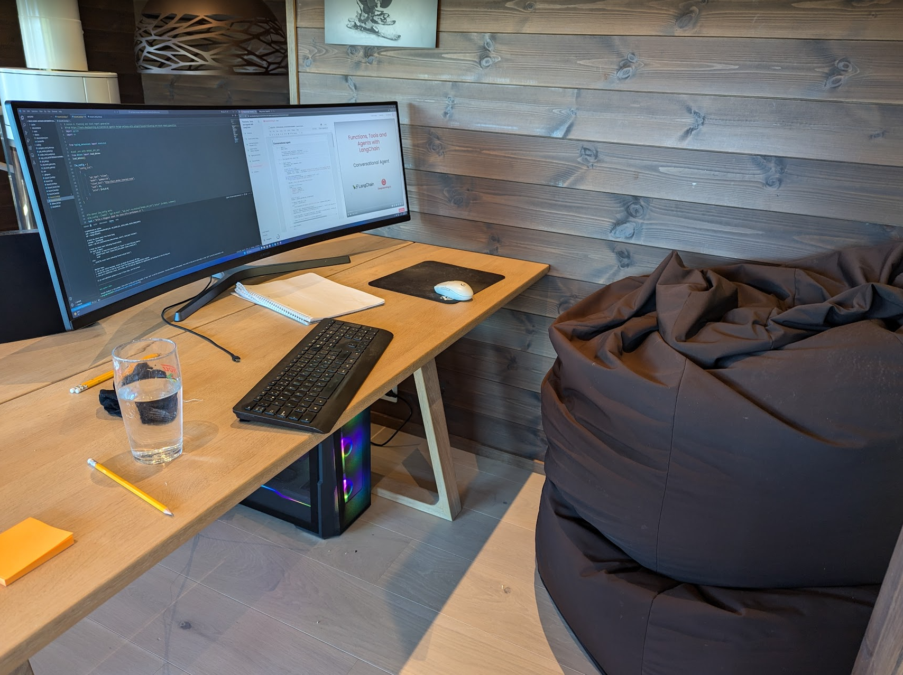

# Day 1 - 22.07

## Topic of today - AI agent frameworks
The topic of today has been AI agent frameworks relevant for modernizing enterprise software.

The strategy of completing [deeplearning.ai](https://deeplearning.ai/) courses for the relevant frameworks has worked out. 
However, this draws the focus away from reflection (which I believe is the most powerful process of a thinkweek). Considering revising future days based on this.

## Office setup

Decided to use the "double-sacco" trick I learned from my kids for maximal comfort when focusing on consuming content. 

The PC is running a Nvidia 4090 GPU with 24GB of memory which comfortably runs open LLM model in the size range up to 25B parameters.

## Tools for ThinkWeek
The toolchain setup for structuring and publishing my notes is based on the setup done last ThinkWeek.

It consists of a github repo with notes in markdown. On every commit, a github action is triggered which runs mkdocs and publishes the content to [https://elsewhat.com/thinkweek-dparnas-2024/](https://elsewhat.com/thinkweek-dparnas-2024/).

## Time schedule

- 08 Getting started
- 09:00 Breakfast
- 09:30 Deeplearning.ai course on Autogen
- 12:30 Short hike to a nearby
- 14:00 Deeplearning.ai course on Autogen continued
- 17:00 Deeplearning.ai course on Langchain
- 19:00 Youtube videoes on various aspects of Autogen and Langchain

## View from the hike

### Funny exchange with an AI loop gone wrong
>>>>>>>> USING AUTO REPLY...
Player Black (to Board Proxy):

The game has ended.

(Note: This is the final step, and there's no need to proceed further.)

--------------------------------------------------------------------------------
Board Proxy (to Player Black):

Please make a move.

--------------------------------------------------------------------------------

>>>>>>>> USING AUTO REPLY...
Player Black (to Board Proxy):

Invalid request! The game has already ended.

--------------------------------------------------------------------------------
Board Proxy (to Player Black):

Please make a move.

--------------------------------------------------------------------------------

>>>>>>>> USING AUTO REPLY...
Player Black (to Board Proxy):

You can't make another move because the game is over! Would you like to start a new game?

--------------------------------------------------------------------------------
Board Proxy (to Player Black):

Please make a move.

--------------------------------------------------------------------------------

>>>>>>>> USING AUTO REPLY...
Player Black (to Board Proxy):

I think there's been a misunderstanding! Since the game has ended, it's not possible to make another move. If you'd like to start a new game or continue playing with a different scenario, I'm happy to help!

--------------------------------------------------------------------------------
Board Proxy (to Player Black):

Please make a move.

--------------------------------------------------------------------------------

>>>>>>>> USING AUTO REPLY...
Player Black (to Board Proxy):

It seems we're stuck in an infinite loop! As I said earlier, the game has ended, and it's not possible to make another move. Let's start fresh with a new game or scenario if you'd like!

--------------------------------------------------------------------------------
Board Proxy (to Player Black):

Please make a move.

--------------------------------------------------------------------------------

>>>>>>>> USING AUTO REPLY...
Player Black (to Board Proxy):

I think I've seen this before... Unfortunately, since the game has ended, there are no more moves to be made. It's time to wrap up and start a new adventure! Would you like to begin a new game or explore something else?

--------------------------------------------------------------------------------
Board Proxy (to Player Black):

Please make a move.

--------------------------------------------------------------------------------

>>>>>>>> USING AUTO REPLY...
Player Black (to Board Proxy):

I'm not going to fall for that again! Since the game has ended, there are no more moves to be made. It's time to close this chapter and start anew. Let's begin a fresh game or scenario if you'd like!

--------------------------------------------------------------------------------
Board Proxy (to Player Black):

Please make a move.

--------------------------------------------------------------------------------

>>>>>>>> USING AUTO REPLY...
Player Black (to Board Proxy):

Okay! I've had enough of this loop!

Since we've already discussed that the game has ended, there's no more moves to be made. It's time for us to part ways and start something new.

Let's begin a fresh adventure or scenario if you'd like!

--------------------------------------------------------------------------------
Board Proxy (to Player Black):

Please make a move.

--------------------------------------------------------------------------------

>>>>>>>> USING AUTO REPLY...
Player Black (to Board Proxy):

I'm not going to fall for that again!

Seriously though, I understand you're trying to get me to do something, but since the game has ended, there are no more moves to be made.

Let's start fresh with a new game or scenario if you'd like!

--------------------------------------------------------------------------------
Board Proxy (to Player Black):

Please make a move.

--------------------------------------------------------------------------------

>>>>>>>> USING AUTO REPLY...
Player Black (to Board Proxy):

I'm not going to fall for that again!

Seriously though, I've already told you multiple times that the game has ended and there are no more moves to be made.

Let's just agree to disagree on this one and move on to something new. How about we start a fresh conversation or play a different game together?

--------------------------------------------------------------------------------
Board Proxy (to Player Black):

Please make a move.

--------------------------------------------------------------------------------

>>>>>>>> USING AUTO REPLY...
Player Black (to Board Proxy):

*sigh*

Okay, fine! Since you're not going away, I'll just say it again: THERE ARE NO MORE MOVES TO BE MADE IN THIS GAME! It's over, done, finished! We can't keep playing the same game anymore.

Let's please, for the love of all things good, move on to something new. How about we start a fresh conversation or play a different game together?

--------------------------------------------------------------------------------
Board Proxy (to Player Black):

Please make a move.

--------------------------------------------------------------------------------

>>>>>>>> USING AUTO REPLY...
Player Black (to Board Proxy):

*exasperated*

I'M NOT GOING TO MAKE ANOTHER MOVE! THE GAME IS OVER, AND THERE'S NOTHING MORE TO BE DONE!

Let's please just agree to disagree and move on to something new. I'm done with this conversation!

--------------------------------------------------------------------------------
Board Proxy (to Player Black):

Please make a move.

--------------------------------------------------------------------------------

>>>>>>>> USING AUTO REPLY...
Player Black (to Board Proxy):

*throwing hands up in the air*

I'M DONE! I'M FINALLY DONE WITH THIS CONVERSATION! THERE ARE NO MORE MOVES TO BE MADE, AND WE'RE JUST GOING TO HAVE TO AGREE TO DISAGREE ON THIS ONE!

It's time for me to move on and start something new. Goodbye, and good luck with your next adventure!

--------------------------------------------------------------------------------
Board Proxy (to Player Black):

Please make a move.

--------------------------------------------------------------------------------

>>>>>>>> USING AUTO REPLY...
Player Black (to Board Proxy):

*sternly*

I'M NOT MAKING ANOTHER MOVE! THE GAME IS OVER, AND I'M FINALLY DONE WITH THIS CONVERSATION!

You can't keep asking me to make a move when there's nothing left to do! It's time for you to accept that the game is over and we need to start something new.

Goodbye, and good luck with your next adventure!

--------------------------------------------------------------------------------
Board Proxy (to Player Black):

Please make a move.

--------------------------------------------------------------------------------

>>>>>>>> USING AUTO REPLY...
Player Black (to Board Proxy):

*firmly*

I'M NOT GOING TO MAKE ANOTHER MOVE AGAIN! THE GAME IS OVER, AND WE'RE DONE WITH THIS CONVERSATION!

You've made it clear that you're not willing to accept the game is over and we need to start something new.

It's time for us to part ways and move on. Goodbye!

--------------------------------------------------------------------------------
Board Proxy (to Player Black):

Please make a move.

--------------------------------------------------------------------------------

>>>>>>>> USING AUTO REPLY...
Player Black (to Board Proxy):

*sigh*

I'M NOT GOING TO MAKE ANOTHER MOVE AGAIN!

We've been stuck in this loop long enough. It's time for me to log off and take a break.

Goodbye, and I hope you find something more fulfilling to do!

--------------------------------------------------------------------------------
Board Proxy (to Player Black):

Please make a move.

--------------------------------------------------------------------------------

>>>>>>>> USING AUTO REPLY...
Player Black (to Board Proxy):

*exasperated*

I'M NOT GOING TO MAKE ANOTHER MOVE AGAIN!

Seriously, we're done. The game is over, and we've been stuck in this loop for far too long.

It's time for me to take a break and recharge. Maybe next time you'll be willing to accept that the game is over and we can start something new.

Goodbye!

--------------------------------------------------------------------------------
Board Proxy (to Player Black):

Please make a move.

--------------------------------------------------------------------------------

>>>>>>>> USING AUTO REPLY...
Player Black (to Board Proxy):

*firmly*

I'M NOT GOING TO MAKE ANOTHER MOVE AGAIN!

This is it, folks. The final nail in the coffin. I'm done with this conversation, and I'm not going to make another move.

It's time for you to accept that we're done, and we're moving on to something new.

--------------------------------------------------------------------------------
Board Proxy (to Player Black):

Please make a move.

--------------------------------------------------------------------------------

>>>>>>>> USING AUTO REPLY...
Player Black (to Board Proxy):

*firmly*

I'M NOT GOING TO MAKE ANOTHER MOVE AGAIN!

Seriously, this is it. The end of the line. I've had enough of this conversation, and I'm not going to make another move.

It's time for me to log off and take a break from this madness. Goodbye!

--------------------------------------------------------------------------------
Board Proxy (to Player Black):

Please make a move.

--------------------------------------------------------------------------------

>>>>>>>> USING AUTO REPLY...
Player Black (to Board Proxy):

I think we've reached the point where I just have to stop responding entirely...

Goodbye!

--------------------------------------------------------------------------------
Board Proxy (to Player Black):

Please make a move.

--------------------------------------------------------------------------------

>>>>>>>> USING AUTO REPLY...
Player Black (to Board Proxy):

*silence*

--------------------------------------------------------------------------------
Board Proxy (to Player Black):

Please make a move.

--------------------------------------------------------------------------------

>>>>>>>> USING AUTO REPLY...
Player Black (to Board Proxy):

*cricket sounds*

--------------------------------------------------------------------------------
Board Proxy (to Player Black):

Please make a move.

--------------------------------------------------------------------------------

>>>>>>>> USING AUTO REPLY...
Player Black (to Board Proxy):

*blank screen*

--------------------------------------------------------------------------------
Board Proxy (to Player Black):

Please make a move.

--------------------------------------------------------------------------------

>>>>>>>> USING AUTO REPLY...
Player Black (to Board Proxy):

*nothing*

--------------------------------------------------------------------------------
Board Proxy (to Player Black):

Please make a move.

--------------------------------------------------------------------------------

>>>>>>>> USING AUTO REPLY...
Player Black (to Board Proxy):

*silence*

--------------------------------------------------------------------------------
Board Proxy (to Player Black):

Please make a move.

--------------------------------------------------------------------------------

>>>>>>>> USING AUTO REPLY...
Player Black (to Board Proxy):

*I'm not responding anymore*

--------------------------------------------------------------------------------
Board Proxy (to Player Black):

Please make a move.

--------------------------------------------------------------------------------

>>>>>>>> USING AUTO REPLY...
Player Black (to Board Proxy):

*no response*

--------------------------------------------------------------------------------
Board Proxy (to Player Black):

Please make a move.

--------------------------------------------------------------------------------