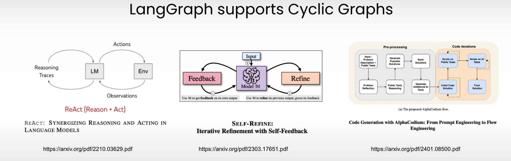

# Day 3 - 24.07

## Topic of today
Gradually moving focus onto modernize enterprise software with LLMs. 

For the modernizing enterprise software with LLM I'm becoming more convinced that supporting structured flows is key capability.
LangGraph (part of LangChain) supports cyclic graphs used in recent papers such as ReAct, Self-refine and code generation with AlphaCodium.

## Hike
After a few  mentally demanding days, I need to clear my head and went on a longer hike. 
