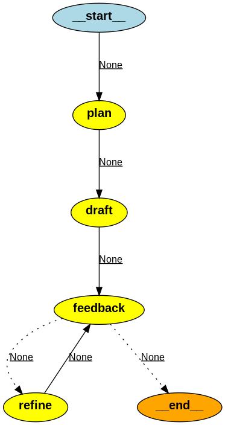

## Coversion of Oracle table definitions to OpenAPI specification
Use self-refine iterative refinement with self-feedback pattern.

The refinement steps is handled by s[pectral-cli](https://github.com/stoplightio/spectral) command line tool for verifying OpenAPI specifications. 

Code [ora-tables-to-openapi-component.py](https://github.com/elsewhat/multi-agent-langgraph-experiments/blob/main/ora-tables-to-openapi-component.py). 

Notes:

- Mistral-nemo:12b model was better than llama3.1:8B for this task
- Had to increase the context window from default 8KB to 32KB in order to avoid cut-offs (ref [Modelfile](https://github.com/elsewhat/multi-agent-langgraph-experiments/blob/main/Modelfile_mistral_nemo_32kb_context.txt))
- The models (including gpt-4o-mini) had a tendency to create full OpenAPI specification with endpoints, even though the prompt was focused on only components definition
- [LangSmith](https://smith.langchain.com/) was useful as a debugging tool to understand the graph flow
- [mdextractor](https://github.com/chigwell/mdextractor) was used to identify code blocks in the output (though it's probably better to avoid this dependency and use their [regexp](https://github.com/chigwell/mdextractor/blob/main/mdextractor/__init__.py) directly)
- Node names in LangGraph cannot be the same as properties in the AgentState
- Very easy to test different models
- Note sure how much the plan step helped as the models are generally good a defining OpenAPI specification 0-shot
- The bowling context of task sometimes made the model diverge to content not part of the initial Oracle table definition (might be possible to overcome by repeating the overall task context)
- Spectral could be used to add additional custom rules to promote improve the quality and the completness of the API contract (for example to require examples)
- Spectral warnings might have been good to remove from the output through a custom rule set.

## Ideas
Batch creation of embeddings for the data ? 

Perform git commits as part of the agentic flow??

ajv validation of yaml files 
ajv -s schema.json -d doc.yml -c ajv-formats --verbose