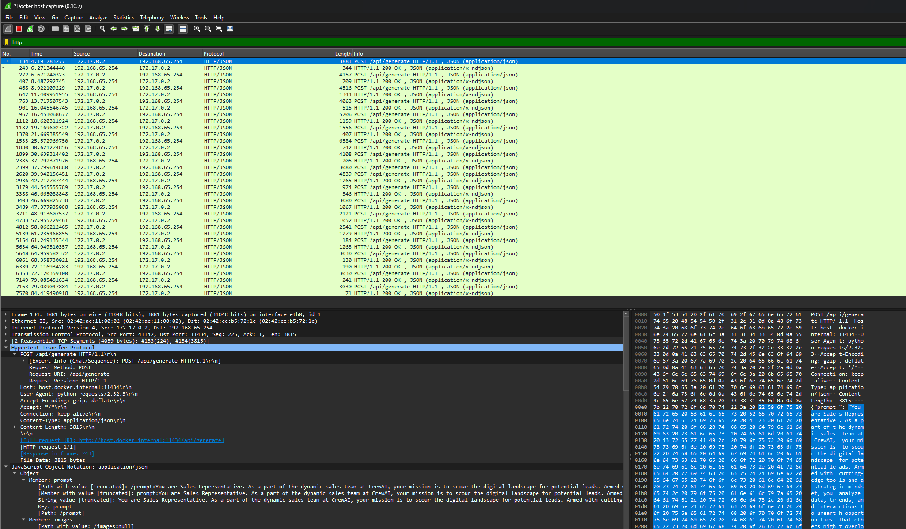

## Hands-on experimentation
Experimentation requires hands-on experience and therefore I worked on code for the major multi-agent frameworks. 
This code in large degree followed the lessons in the [deeplearning.ai courses](https://learn.deeplearning.ai/), but were extended to

- Use local models instead of closed models
- Run in devcontainer docker containers

- AutoGen [elsewhat/multi-agent-autogen-experiments](https://github.com/elsewhat/multi-agent-autogen-experiments)
- CrewAI [elsewhat/multi-agent-crewai-experiments](https://github.com/elsewhat/multi-agent-crewai-experiments)
- LangChain [elsewhat/multi-agent-langgraph-experiments](https://github.com/elsewhat/multi-agent-langgraph-experiments)

## No framework
There is a convincing argument to be made that agentic workflows do not need to use a framework. 

- Matt Williams makes this argument in his video [Have You Picked the Wrong AI Agent Framework?](https://youtu.be/jLVl5V8roMU?si=jIrHkeQ4c9EkVTeV)
- Dave Ebbekaar makes the same argument in [Why Agent Frameworks Will Fail (and what to use instead)](https://www.youtube.com/watch?v=KY8n96Erp5Q)

One of their key argument is that you in most cases already know the well-defined workflow to be followed and simplicity is much easier to maintain without a AI agent framework in these cases.
(and selectively use tools such as state machine [xstate](https://github.com/statelyai/xstate) or [dirty-json ](https://github.com/RyanMarcus/dirty-json)). 

Matt Williams believes AI agent frameworks are relevant "When you have a job that doesn't have a well-defined workflow where you need the model to do thinks close to reasoning" (but this is a small minority of solutions). 

There is plenty of truths to this, but not all of the arguments can be translated directly to an enterprise software setting. 
Here there right frameworks provide additional benefits for how the code is maintained and extended over its lifetime.

My major gripe with the frameworks so far, is that they are very opinionated in their abstractions and in many cases these abstraction add significant amount of complexity.

## Inspection framework network traffic
I'm running the frameworks from a devcontainer docker image and connecting either to local models hosted by ollama or to llm providers such as openai og anthropic. 

It's useful to be able to inspect the network traffic coming from the docker image. 
[Edgeshark](https://edgeshark.siemens.io/) provides a method for this. 

Install through:

- [Docker Compose v2 command](https://edgeshark.siemens.io/#/getting-started?id=service-deployment) from ubuntu wsl running locally (outside any docker container)
- Install Wireshark
- Install Wireshark Capture plugin (was unable to capture via the WebUI although it should be supported)

To capture, run wireshark and start a capture via [Docker host capture](https://edgeshark.siemens.io/#/capture-extcap) (created by the Wireshark capture plugin).

